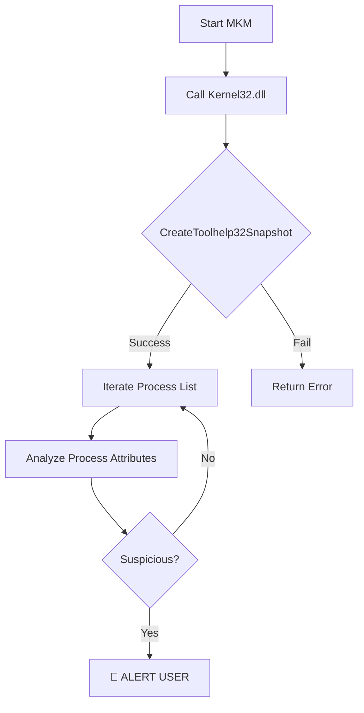

# 🛡️ MouseKeyMonitor (MKM)


## 📖 Overview
**MouseKeyMonitor** is a Windows-based defensive utility designed to detect potential **User Input Surveillance (Keylogging)** activities. 

Unlike signature-based antiviruses, MKM uses **Heuristic Analysis** to scan active processes for suspicious behaviors often exhibited by spyware, such as running without visible windows, masquerading as system services, or hooking input without authorization.

## ⚙️ How It Works (Internal Architecture)
The tool interacts directly with the Windows Kernel via the **Win32 API**. It takes a "snapshot" of the system's memory to inspect every running thread and process.



### Technical Concepts Demonstrated

  * **WinAPI Integration:** Direct interaction with `Kernel32.dll`.
  * **System Snapshots:** Using `CreateToolhelp32Snapshot` to freeze system state.
  * **Memory Traversal:** Iterating through `PROCESSENTRY32` structures.
  * **Heuristic Scanning:** Identifying anomalies based on behavior rather than file signatures.

## 🚀 Features

  * **Real-time Process Enumeration:** Instant analysis of all running tasks.
  * **Stealth Detection:** Identifies processes that may be hiding from the standard Task Manager.
  * **Lightweight:** Zero external dependencies; runs natively on Windows.

## 🛠️ Build Instructions

### Prerequisites

  * Windows 10/11
  * Visual Studio 2022 (or any C++ Compiler supporting WinAPI)

### Compilation

1.  Clone the repository:
    ```bash
    git clone [https://github.com/Anonymouse-dev-hub/MouseKeyMonitor.git](https://github.com/Anonymouse-dev-hub/MouseKeyMonitor.git)
    ```
2.  Open `MouseKeyMonitor.sln` in Visual Studio.
3.  Set configuration to **Release / x64**.
4.  Build the solution (`Ctrl + Shift + B`).
5.  Run the executable as Administrator to ensure full visibility.

## 📝 Code Sample (Process Snapshot)

A core component of the tool is accessing the system snapshot using the Windows API:

```cpp
HANDLE hProcessSnap;
PROCESSENTRY32 pe32;

// Take a snapshot of all processes in the system
hProcessSnap = CreateToolhelp32Snapshot(TH32CS_SNAPPROCESS, 0);

if (hProcessSnap == INVALID_HANDLE_VALUE) {
    // Handle Error
}
```

## 🗺️ Roadmap

  - [ ] Add real-time logging to a local text file.
  - [ ] Implement a whitelist system for trusted processes.
  - [ ] Add a GUI (Graphical User Interface) for easier monitoring.
  - [ ] Send email alerts when a highly suspicious process is detected.

## 🤝 Contributing

Contributions, issues, and feature requests are welcome\!
Feel free to check the [issues page]([https://www.google.com/search?q=https://github.com/Anonymouse-dev-hub/MouseKeyMonitor/issues](https://github.com/Anonymouse-dev-hub/MouseKeyMonitor/issues)) if you want to contribute.

1.  Fork the repository
2.  Create your Feature Branch (`git checkout -b feature/AmazingFeature`)
3.  Commit your changes (`git commit -m 'Add some AmazingFeature'`)
4.  Push to the branch (`git push origin feature/AmazingFeature`)
5.  Open a Pull Request

## 📧 Contact

**Anonymouse-dev-hub** Project Link: [https://github.com/Anonymouse-dev-hub/MouseKeyMonitor](https://github.com/Anonymouse-dev-hub/MouseKeyMonitor)

## 📝 License

Distributed under the MIT License. See `LICENSE` for more information.

## ⚠️ Disclaimer

This tool is for **educational and defensive purposes only**. It is designed to help security professionals understand how to audit system processes and detect unauthorized monitoring tools. The author is not responsible for misuse.


